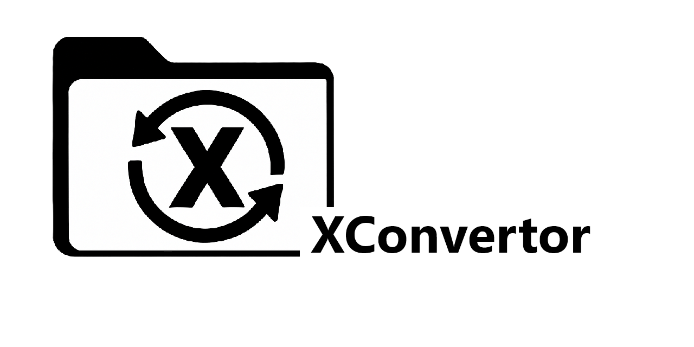
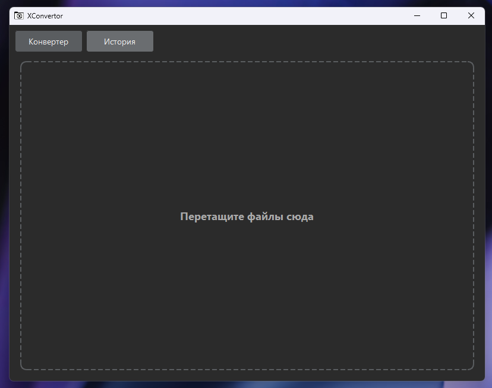
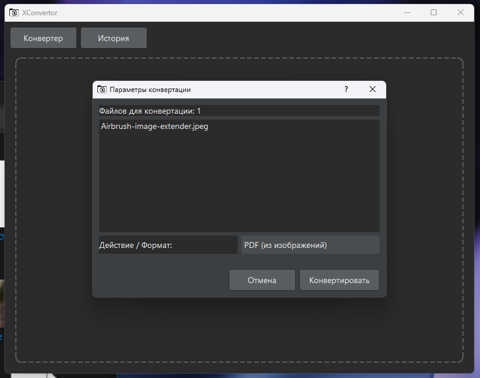
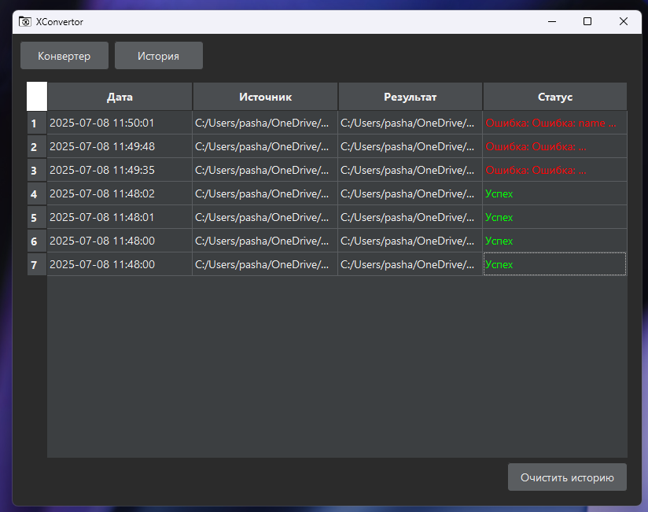

# XConvertor
<p align="center">
  
  
  
  
</p>

<div align="center">
  
</div>

<div align="center">
  <p>
    <strong>Универсальный и минималистичный офлайн-конвертер файлов для Windows, macOS и Linux.</strong>
  </p>
  <p>
    Создан для быстрой и удобной работы с документами, изображениями, аудио и видео без необходимости загружать файлы в интернет.
  </p>
</div>

## ✨ Внешний вид

Простой, чистый и интуитивно понятный интерфейс с поддержкой темной темы.

| Главное окно (Drag & Drop) | Диалог конвертации | История конвертаций |
| :---: | :---: | :---: |
|  |  |  

## 🚀 Основные возможности

-   **Универсальная конвертация**: Работает с документами, изображениями, аудио и видео.
-   **Полностью оффлайн**: Ваши файлы никогда не покидают ваш компьютер.
-   **Drag & Drop интерфейс**: Просто перетащите файлы или папки в окно для начала работы.
-   **Пакетная обработка**: Конвертируйте сотни файлов за один раз.
-   **Интеграция с ОС**: Добавляется в контекстное меню Windows для быстрого доступа.
-   **Работа с PDF**: Объединение, разделение и распознавание текста (OCR).
-   **Обработка аудио и видео**: Извлечение аудиодорожек, конвертация в GIF и многое другое.
-   **История конверсий**: Легко отслеживайте все выполненные операции.
-   **Минималистичный дизайн**: Темная тема и отсутствие лишних элементов.

## 🗂️ Поддерживаемые форматы

| Категория | Из формата (вход) | В формат (выход) |
| :--- | :--- | :--- |
| 🖼️ **Изображения** | `.jpg`, `.png`, `.bmp`, `.webp`, `.tiff` | `.jpg`, `.png`, `.bmp`, `.webp`, `.tiff`, `PDF (из изображений)`, `TXT (OCR)` |
| 🎞️ **Видео** | `.mp4`, `.avi`, `.mkv`, `.mov`, `.webm` | `.mp4`, `.avi`, `.mkv`, `.mov`, `.webm`, `GIF (анимация)`, `MP3/WAV/FLAC (аудио)` |
| 🎵 **Аудио** | `.mp3`, `.wav`, `.flac`, `.aac`, `.ogg` | `.mp3`, `.wav`, `.flac`, `.aac`, `.ogg` |
| 📄 **Документы (PDF)** | `.pdf` | `.docx`, `.txt`, `.jpg`, `.png` |
| 📄 **Документы (Прочие)** | `.docx`, `.txt`, `.rtf` | `.pdf`, `.txt` |

## 🛠️ Установка

Для работы приложения необходимо установить несколько ключевых компонентов.

### Шаг 1: Установка внешних зависимостей

Это самые важные компоненты, которые обеспечивают работу с медиафайлами и текстом.

1.  **Python 3.8+**
    -   Скачайте с [официального сайта python.org](https://www.python.org/downloads/).
    -   **Важно:** Во время установки в Windows обязательно поставьте галочку **"Add Python to PATH"**.

2.  **FFmpeg** (для работы с аудио и видео)
    -   **Windows**: Скачайте сборку с [gyan.dev](https://www.gyan.dev/ffmpeg/builds/) (например, `ffmpeg-release-full.7z`), распакуйте и добавьте путь к папке `bin` в системную переменную `PATH`.
    -   **macOS**: `brew install ffmpeg`
    -   **Linux (Debian/Ubuntu)**: `sudo apt update && sudo apt install ffmpeg`

3.  **Tesseract OCR** (для распознавания текста)
    -   **Windows**: Скачайте установщик с [UB-Mannheim](https://github.com/UB-Mannheim/tesseract/wiki), запустите и **обязательно** отметьте опцию добавления в `PATH`.
    -   **macOS**: `brew install tesseract`
    -   **Linux (Debian/Ubuntu)**: `sudo apt install tesseract-ocr`

### Шаг 2: Клонирование репозитория

Откройте терминал или Git Bash и выполните команду:
```bash
git clone https://github.com/ReNothingg/XConvertor
cd XConvertor
```
Или просто скачайте ZIP-архив проекта и распакуйте его.

### Шаг 3: Установка Python-библиотек

В папке проекта выполните команду для установки всех необходимых библиотек:
```bash
pip install -r requirements.txt
```

## 🖱️ Как использовать

### Запуск приложения

Для запуска основного интерфейса выполните команду в папке проекта:
```bash
python main.py
```

### Интеграция в контекстное меню (Windows)

Чтобы добавить пункт **"Конвертировать с XConvertor"** в меню правого клика:

1.  Откройте командную строку (CMD) или PowerShell **от имени администратора**.
2.  Перейдите в папку проекта: `cd path/to/XConvertor`.
3.  Выполните скрипт:
    ```bash
    python add_to_registry.py
    ```
Для удаления пункта из меню используйте скрипт `remove_from_registry.py` (также с правами администратора).

### Основной процесс

1.  **Перетащите файлы** или папки в главное окно приложения.
2.  Если вы перетащили один или несколько файлов одного типа, откроется **диалог конвертации**.
3.  В диалоге выберите **конечный формат** или действие (например, "Объединить PDF").
4.  Нажмите **"Конвертировать"** и выберите место для сохранения результата.
5.  Процесс и результат операции будут записаны во вкладке **"История"**.

## ⚙️ Технологический стек

-   **Графический интерфейс**: PyQt5
-   **Работа с изображениями**: Pillow (PIL)
-   **Работа с аудио**: pydub
-   **Работа с видео**: MoviePy
-   **Работа с PDF**: PyPDF2, reportlab
-   **Работа с DOCX**: python-docx
-   **Распознавание текста (OCR)**: pytesseract

## 📄 Лицензия

Проект распространяется под лицензией MIT. Подробности смотрите в файле `LICENSE`.